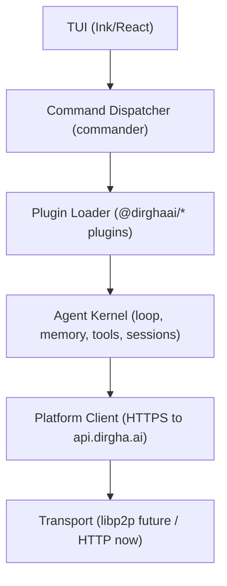
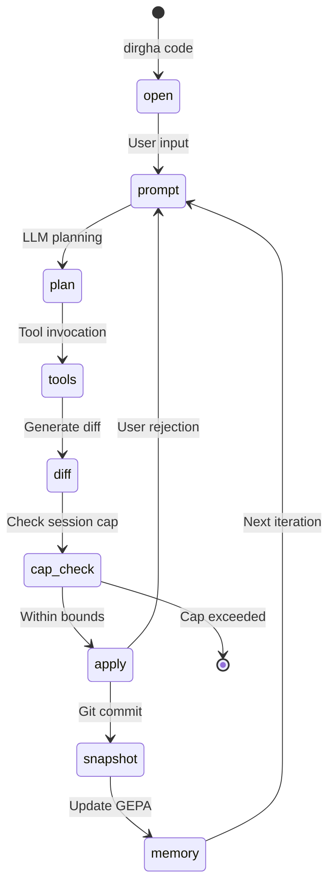
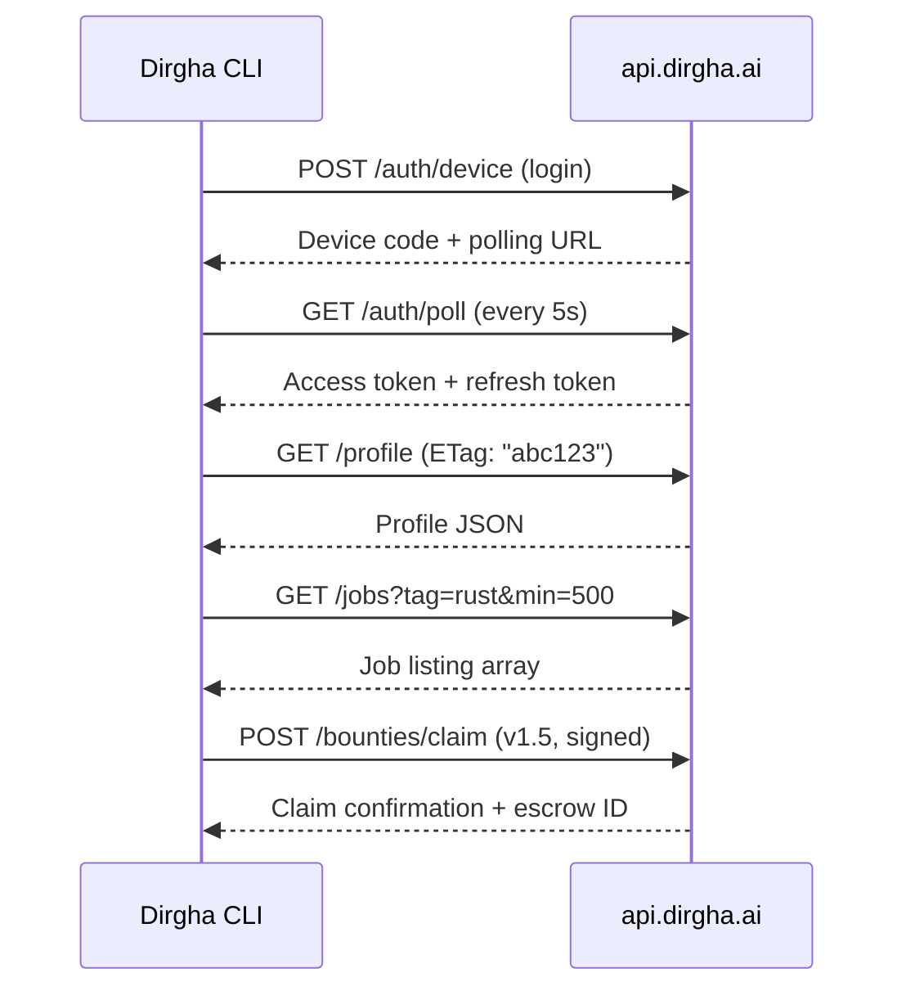
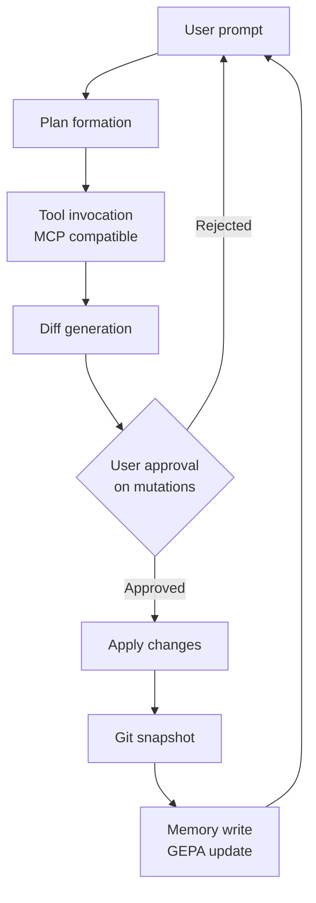

# Architecture

## CLI Layers

The Dirgha CLI is organized as a stack of six distinct layers, each with a single responsibility and a narrow interface to its neighbors. This separation allows the terminal interface to evolve independently from the agent kernel, and permits the transport layer to migrate from centralized HTTPS to peer-to-peer libp2p without touching business logic.

The top layer is the Terminal UI, built on Ink and React, which renders the interactive prompt, diff viewers, and session status. Below that, the Command Dispatcher uses commander.js to parse arguments and route to subcommands. The Plugin Loader dynamically imports `@dirghaai/*` packages, validating their manifests against a strict schema before injecting them into the kernel. The Agent Kernel is the heart: it maintains the LLM reasoning loop, enforces session caps, manages tool registries, and coordinates memory access. The Platform Client handles all HTTPS traffic to `api.dirgha.ai`, including authentication, job listings, and profile sync. Finally, the Transport layer abstracts the wire protocol; today it is a thin wrapper around Node.js `https`, but the interface is designed to accept libp2p streams for the upcoming mesh release.

Source of truth: `src/cli/index.ts`

## Session Lifecycle

A Dirgha session is a finite state machine with hard boundaries. When the user invokes `dirgha code`, the kernel initializes a new session context, loads the relevant memory shards from GEPA, and enters the prompt state. The LLM receives the user input and any attached context, then emits a plan. The plan may invoke tools (file read, grep, browser use) via the MCP-compatible adapter. Results flow back into the context window, and the LLM generates a diff. Before any mutation touches the filesystem, the kernel checks the session cap: if the turn count exceeds 50 or the context window exceeds 500MB, the session halts and requires explicit continuation. If within bounds, the user approves the diff (or auto-apply is enabled for trusted paths), the kernel writes the change, commits a git snapshot, updates the memory graph, and returns to the prompt state for the next iteration.

Source of truth: `src/agent/session.ts`

## Polyblock API Contract

The CLI communicates with the Dirgha platform via the Polyblock API, a JSON-over-HTTPS protocol with strict versioning and idempotent semantics. Authentication uses a device flow: the CLI requests a device code, polls the authorization endpoint, and receives a short-lived access token and long-lived refresh token. All subsequent requests carry a `Authorization: Bearer <token>` header. Profile operations are atomic read-modify-write cycles with ETag validation to prevent clobbering concurrent updates from multiple devices. Job listings support cursor-based pagination and server-side filtering by tags, budget range, and currency. Bounty claims (available in v1.5) require a signed payload including the claimaint's public key and a timestamp within 60 seconds of the server time to prevent replay attacks.

Source of truth: `src/platform/client.ts`

## Agent Loop

The agent loop is a deterministic cycle of planning, execution, and reflection. The user prompt enters the kernel, which constructs a plan using the current context and available tools. The plan is executed via the Model Context Protocol (MCP) adapter, allowing external tools to run in isolated processes. Tool outputs are serialized and returned to the LLM, which generates a unified diff against the working directory. If the diff contains mutations (file writes, moves, or deletes), the kernel pauses for user approval unless the path is in the auto-apply allowlist. Upon approval, the kernel applies the diff, writes a checkpoint to the git snapshot buffer, and updates the GEPA memory graph with the new state. The loop then iterates, carrying forward the updated context.

Source of truth: `src/agent/loop.ts`

## Design Principles

1. **Plugin-loadable.** All non-core functionality lives in `@dirghaai/*` packages loaded at runtime. The kernel exposes a strict interface for tool registration, session hooks, and transport adapters.

2. **MCP-compatible.** Tool execution uses the Model Context Protocol, allowing Dirgha to consume tools from other agent ecosystems and export its own tools to compatible hosts.

3. **JSON-output discipline.** All CLI commands support `--json` for machine-readable output. No parsing of human-readable tables required for scripting.

4. **Session caps as a first-class feature.** The 50-turn / 500MB limit is enforced at the kernel level, not the UI level. This prevents accidental runaway costs and encourages compositional workflows.

5. **Memory as a first-class subsystem.** GEPA is not a cache; it is a persistent, queryable knowledge graph with vector search and temporal versioning. It survives session restarts and machine migrations.

6. **Decentralized-ready.** The transport layer is abstracted. The CLI already includes libp2p plumbing for peer discovery and NAT traversal, awaiting the v2.0 mesh activation.
