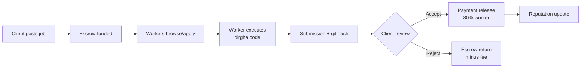

# Jobs Marketplace

Dirgha Jobs is the first jobs marketplace that lives inside your terminal. Post work, apply from CLI, get paid in fiat or DIRGHA. It is built on the premise that agentic coding requires agentic economics: if a CLI can write code, it should also be able to discover, bid, and invoice for that code.

## What It Is

The marketplace connects clients who need code with developers (human or agentic) who can deliver it. Unlike traditional platforms that trap you in web dashboards, Dirgha exposes the entire lifecycle—posting, browsing, applying, submitting, and payment—through the CLI and a standard API. This allows for automation: a CI pipeline can post a bounty when tests fail, and a developer can batch-apply to ten Rust jobs with a single shell loop.

The unit of work is the **Job**: a scoped task with a description, acceptance criteria, budget, and escrow. Jobs carry tags for discovery (e.g., `rust`, `react`, `security-audit`) and a difficulty rating. **Bounties** are a special class of job with open competition: multiple workers submit solutions, and the client selects the winner, with the escrow releasing only to the accepted submission.

## How It Works

The flow is linear but forked at the verification stage:

1. **Client posts** a job via `dirgha jobs create` or the web UI, funding the escrow with USDC or DIRGHA.
2. **Workers browse** via `dirgha jobs list` and filter by skill, budget, or reputation requirements.
3. **Worker applies** (v1.0: browser; v1.5: `dirgha jobs apply <id>`), staking a small reputation bond.
4. **Worker executes** using `dirgha code` within a sandboxed session that records the git history.
5. **Worker submits** the solution hash and a manifest of files changed.
6. **Client reviews** the diff and the automated test results.
7. **Payment releases** from escrow to the worker upon acceptance, or returns to client upon rejection (minus a dispute fee).



## Pay Splits

When a job completes, the escrow distributes as follows:

- **80%** to the worker
- **10%** to the sovereign fund (protocol treasury)
- **10%** to operations and contributors (infrastructure, moderation, development)

This split is hardcoded in the escrow contract (v2.0) and visible in the job metadata before you apply. There are no hidden fees or platform markups beyond the 20% total take, which is disclosed upfront.

## Getting Started

Update your profile to signal availability:

```bash
dirgha profile update --skill rust --skill wasm --hourly 80 --currency USD
```

List jobs matching your rate:

```bash
dirgha jobs list --tag rust --min 500 --max 2000
```

Open a specific job in your browser to review details:

```bash
dirgha jobs open job_7f8a9b
```

In v1.5, apply directly:

```bash
dirgha jobs apply job_7f8a9b --message "I can optimize this WASM module. ETA 2 days."
```

## FAQ

**What currencies does the escrow support?**
USDC on Ethereum and Polygon, plus native DIRGHA tokens. Fiat payouts (USD, EUR) via Stripe Connect are planned for v1.5.

**Are there KYC requirements?**
For jobs under $600 USD equivalent, no KYC is required. Above that threshold, both clients and workers must complete identity verification to comply with AML regulations. This is enforced at the escrow level in v1.5.

**How are disputes resolved?**
v1.0 uses centralized moderation. v1.5 introduces a council of senior contributors. v2.0 moves to a DAO-governed arbitration system with staked jurors.

**Is there a reputation system?**
Yes, but it is not yet public. v2.0 exposes on-chain reputation scores derived from completion rate, client ratings, and code quality metrics (test coverage, cyclomatic complexity reduction).

**Can I post jobs as a company?**
Yes. Use `dirgha jobs create --org mycompany` after verifying your domain. Organization profiles support multiple seats and consolidated billing.

## Roadmap

- **v1.0** — Browser-based apply, centralized escrow, USDC only, manual dispute resolution
- **v1.5** — Native CLI apply (`dirgha jobs apply`), USDC payouts to worker wallets, reputation bonds, contributor council arbitration
- **v2.0** — On-chain escrow contracts, DIRGHA token integration, DAO-governed disputes, automated quality oracles (test pass rates, static analysis scores)

The marketplace is optional. You can use Dirgha as a standalone coding agent without ever touching a job or bounty. But if you choose to participate, the economics are transparent, the splits are fixed, and the infrastructure is open.
